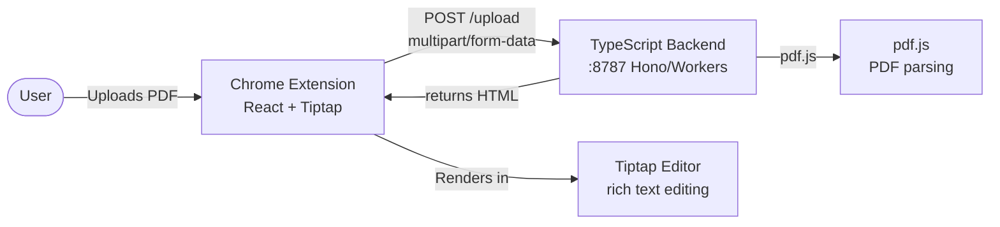
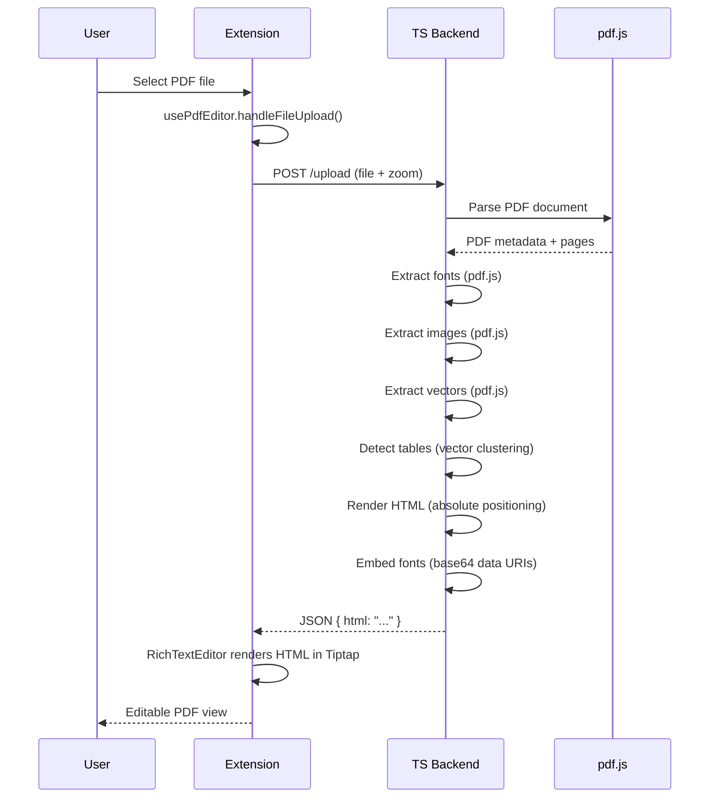

# Architecture

## Architecture Overview

PDF Editor is a two-component system for viewing and editing PDF documents in the browser. A **Chrome extension** (React/TypeScript) serves as the frontend, and a **TypeScript backend** (Cloudflare Workers) handles PDF-to-HTML conversion using pdf.js. The backend transforms PDF files into semantic HTML with embedded fonts, images, and vector graphics, which the extension then renders in a Tiptap-based rich text editor.

A legacy **Python FastAPI backend** exists in `backend/` but is being phased out in favor of the TypeScript implementation.

**Architectural style:** Client-server with extension shell. The backend is stateless and request-scoped (each upload gets in-memory buffers, processed, then cleaned up). The frontend is a Chrome Manifest V3 extension that opens a dedicated editor tab.

## 1. Project Structure

```
PDF-editor/
├── ts-backend/                       # TypeScript backend (Cloudflare Workers)
│   ├── src/
│   │   ├── index.ts                  # Hono app entry point
│   │   ├── models/
│   │   │   ├── types.ts              # TypeScript interfaces
│   │   │   └── constants.ts          # Pipeline constants
│   │   ├── services/
│   │   │   ├── pdf-service.ts        # Core conversion orchestrator
│   │   │   ├── font-extractor.ts     # Font extraction from pdf.js
│   │   │   ├── font-embedder.ts      # @font-face CSS generation
│   │   │   ├── font-cache.ts         # LRU cache + R2 persistence
│   │   │   ├── image-extractor.ts    # Image extraction
│   │   │   ├── vector-parser.ts      # Vector element parsing
│   │   │   ├── table-detector.ts     # Table structure detection
│   │   │   ├── table-merger.ts       # Adjacent table merging
│   │   │   ├── html-renderer.ts      # HTML rendering engine
│   │   │   └── image-position.ts     # Image position matching
│   │   └── routers/
│   │       ├── pdf.ts                # POST /upload endpoint
│   │       └── health.ts             # GET /health endpoint
│   ├── wrangler.toml                 # Cloudflare Workers config
│   ├── package.json                  # Node dependencies
│   └── tsconfig.json                 # TypeScript config
├── backend/                          # Legacy Python FastAPI server (deprecated)
│   ├── main.py                       # App entry point
│   ├── services/                     # PDF processing services
│   └── ...                           # (see Python backend docs)
├── extension/                        # Chrome extension (React/TypeScript)
│   ├── src/
│   │   ├── editor.tsx                # Main editor entry point
│   │   ├── hooks/
│   │   │   └── usePdfEditor.ts       # Editor state management hook
│   │   ├── services/
│   │   │   └── pdfService.ts         # Backend API client (port 8787)
│   │   └── components/
│   │       ├── EditorView.tsx        # Main editor layout
│   │       ├── RichTextEditor/       # Tiptap-based rich text editor
│   │       │   ├── RichTextEditor.tsx
│   │       │   ├── extensions.ts     # Custom Tiptap extensions
│   │       │   └── EditorToolbar.tsx
│   │       └── ...
│   ├── manifest.json                 # Chrome MV3 manifest
│   └── package.json                  # Node dependencies
├── openspec/                         # OpenSpec change management
├── ARCHITECTURE.md                   # This file
└── DESIGN.md                         # Design system documentation
```

## 2. High-Level System Diagram



## 3. Core Components

### 3.1 Frontend — Chrome Extension

**Responsibility:** User interface for uploading PDFs, displaying converted HTML, and enabling rich text editing.

**Key files:**
- `extension/src/editor.tsx` — App entry, state management via `usePdfEditor` hook
- `extension/src/hooks/usePdfEditor.ts` — Central state: file, htmlContent, isLoading, error, zoom
- `extension/src/services/pdfService.ts` — HTTP client posting to `http://localhost:8085/upload`
- `extension/src/components/RichTextEditor/` — Tiptap editor with custom extensions

**Technologies:** React 19, TypeScript, Vite 7, Tailwind CSS v4, Tiptap (ProseMirror), Chrome Extension Manifest V3

**Custom Tiptap Extensions:**
- `Div` — Preserves `<div>` elements with class/style/id attributes for PDF layout fidelity
- `Span` — Preserves `<span>` marks for inline font/color styling from PDF
- `ExtendedParagraph` — Preserves class/style on `<p>` elements
- Table extensions with `data-col-widths` attribute for column width persistence

**Inputs:** PDF file (via file input), zoom level
**Outputs:** Displays editable HTML rendering of the PDF

### 3.2 Backend — TypeScript (Cloudflare Workers)

**Responsibility:** Convert uploaded PDF files to semantic HTML with embedded fonts, images, and vector graphics.

**Key files:**
- `ts-backend/src/index.ts` — Hono app entry point with CORS and routes
- `ts-backend/src/routers/pdf.ts` — `POST /upload` endpoint (file + zoom → HTML)
- `ts-backend/src/services/pdf-service.ts` — Core orchestrator: parse → fonts → images → vectors → tables → HTML

**Technologies:** TypeScript, Hono, pdf.js, LRU-cache, Cloudflare Workers

**Conversion Pipeline (pdf-service.ts):**
1. Parse PDF with pdf.js
2. Extract fonts via `FontExtractor` (pdf.js)
3. Extract images via `ImageExtractor` (pdf.js)
4. Extract vectors via `VectorParser` (pdf.js)
5. Detect tables via `TableDetector` (vector-based grid detection)
6. Render HTML via `HtmlRenderer` (absolute positioning)
7. Embed fonts via `FontEmbedder` (base64 data URIs)

**Inputs:** PDF bytes + zoom level (float)
**Outputs:** JSON `{ html: string }`

### 3.3 XML Parser Engine

**Responsibility:** Convert pdftohtml XML output into semantic HTML with tables, images, vectors, and proper styling.

**Key sub-modules:**
- `parser/` — Core XML parsing, page/block/element logic, rendering orchestration
- `extractors/` — Element extraction, font mapping, image matching
- `renderers/` — HTML rendering for text blocks and grid tables
- `table_detector/` — Table structure detection (line clustering, cell merging, column inference, grid building)
- `flow_processor/` — Reading order detection, column/row analysis, table merging
- `models.py` — Data classes: `FontSpec`, `TextElement`, `ImageElement`, `TableRow`, `TableCell`, `TableDefinition`

### 3.4 Font Pipeline

**Responsibility:** Extract fonts from PDFs, cache them, and generate `@font-face` CSS for embedding.

**Key files:**
- `font_embedder.py` — Main orchestrator: extract → base64-encode → generate CSS → cache
- `font_cache.py` — Filesystem cache with hash-based verification, JSON metadata
- `font_extractor/` — PyMuPDF-based font detail extraction (weight, style detection)

**Caching:** SHA-256 hash of font data stored as cache key; CSS files cached in `fonts_cache/` directory.

## 4. Data Flow

### Request Lifecycle



### Zoom Flow

When the user changes zoom:
1. `usePdfEditor.handleZoomChange()` updates state and re-uploads the same PDF
2. Backend receives new zoom level, recalculates DPI scaling
3. pdftohtml runs at the new scale (capped at 3.0x)
4. If scale ≠ 1.0, a second pdftohtml run at 1.0x provides clean table detection XML
5. Final HTML combines zoomed rendering with properly-detected table structures

## 5. Data Stores

| Store | Type | Purpose | Location |
|-------|------|---------|----------|
| Font cache | In-memory + R2 | LRU cache for font CSS entries | `ts-backend` (Workers runtime) |
| Request buffers | In-memory | Per-request PDF processing | `ts-backend` (Workers runtime) |
| Chrome storage | Browser API | Extension preferences (via `util.ts`) | `chrome.storage.local` |

No traditional database. All state is request-scoped or browser-local.

## 6. External Integrations / APIs

| Integration | Method | Config | Auth | Failure Behavior |
|-------------|--------|--------|------|------------------|
| pdf.js | npm package | Local | None | N/A (bundled) |
| Chrome Extension APIs | Browser API | `manifest.json` | User permission | Graceful degradation |
| Backend server | HTTP `fetch` | `localhost:8787` (hardcoded) | None | Error displayed in UI |

## 7. Key Technologies

| Layer | Technology | Version | Role |
|-------|-----------|---------|------|
| Frontend | React | 19.2.3 | UI framework |
| Frontend | TypeScript | 5.9.3 | Type safety |
| Frontend | Vite | 7.2.7 | Build tool + dev server |
| Frontend | Tailwind CSS | 4.1.18 | Styling (via `@tailwindcss/vite`) |
| Frontend | Tiptap | 3.13.x | Rich text editor (ProseMirror) |
| Frontend | JSZip | 3.10.1 | Build-time zip packaging |
| Frontend | Lucide React | 0.561.0 | Icons |
| Backend | TypeScript | 5.x | Runtime |
| Backend | Hono | latest | HTTP framework (Workers) |
| Backend | pdf.js | latest | PDF parsing + font/image extraction |
| Backend | LRU-cache | latest | In-memory font caching |
| Backend | Cloudflare Workers | - | Serverless runtime |

## 8. Deployment & Infrastructure

**Development setup:**
```bash
# TypeScript Backend (Cloudflare Workers)
cd ts-backend && npm run dev  # wrangler dev

# Extension
cd extension && npm run dev  # Vite watch mode
```

**Build artifacts:**
- `extension/dist/` — Built extension files
- `extension/zip/pdf-editor<version>.zip` — Packaged extension for Chrome Web Store (auto-generated by Vite plugin)

**Deployment:**
- TypeScript backend deploys to Cloudflare Workers via `wrangler deploy`
- Extension distributed via Chrome Web Store or sideloaded

**No containerization, no CI/CD pipeline, no deployment automation.**

## 9. Security Architecture

- **CORS:** Currently allows all origins (`*`) — flagged for restriction
- **No authentication** on the backend upload endpoint
- **No input validation** beyond content-type check (`application/pdf`)
- **No rate limiting** on upload endpoint
- **In-memory buffers** — request-scoped, cleaned up after each request
- **Chrome extension permissions:** Only `storage` requested (minimal)
- **Service worker** opens editor in a new tab on icon click (no background processing)

## 10. Monitoring & Observability

- **Logging:** Console logging in Workers runtime
- **No metrics, tracing, or error reporting**
- **Health check:** `GET /health` returning `{"status": "ok"}`**

## 11. Performance & Scalability

- **In-memory request buffers** — no filesystem I/O overhead
- **Font caching** (LRU + R2) avoids re-extracting the same fonts across requests
- **Serverless deployment** — Cloudflare Workers auto-scale with demand
- **Image extraction** uses pdf.js built-in methods (efficient)
- **Single-threaded backend** — Workers are single-threaded but handle concurrent requests via async

## 12. Development Workflow

| Command | Location | Purpose |
|---------|----------|---------|
| `npm run dev` | `ts-backend/` | Start TypeScript backend (wrangler dev) |
| `npm run dev` | `extension/` | Vite watch mode (builds extension) |
| `npm run build` | `extension/` | Production build + zip |

**Prerequisites:**
- Node.js (v22.18.0+)
- npm

## 13. Testing Strategy

- `backend/tests/` directory exists with analysis documentation (`README_TABLE_ROWS.md`, `TABLE_ROW_ANALYSIS.md`)
- No visible automated test suite (no pytest configuration, no test runner scripts)
- `test_output*.txt` files in backend root suggest manual testing via script execution
- No frontend tests (no test framework in `package.json` devDependencies)

## 14. Architectural Decisions & Rationale

1. **pdf.js over pdftohtml** — Pure JavaScript PDF parsing; no system dependency; runs in Workers
2. **TypeScript backend over Python** — Serverless deployment to Cloudflare Workers; no cold start; auto-scaling
3. **Hono over FastAPI** — Lightweight HTTP framework designed for edge runtimes
4. **Tiptap over raw contentEditable** — Structured editing with extension system; custom extensions preserve PDF layout attributes
5. **Server-side zoom** — Rendering at the correct DPI on the server ensures visual fidelity; client-only zoom would require re-rendering the entire PDF
6. **Font embedding via base64 data URIs** — Self-contained HTML output; no need for font file serving
7. **Chrome extension (not web app)** — Access to Chrome APIs, native PDF handling, browser integration

## 15. Constraints, Risks, and Technical Debt

- **Hardcoded backend URL** (`localhost:8787`) in `pdfService.ts` — no config mechanism
- **No auth/rate limiting** — backend is open to any client
- **CORS wildcard** — documented as temporary
- **No automated tests** — manual testing only
- **No CI/CD** — no automated builds, linting, or deployment
- **Print-based logging** — no structured logging, no log levels
- **Legacy Python backend** — still exists in `backend/` but deprecated
- **Options page is empty** — `options.tsx` is a placeholder
- **Zoom re-uploads entire PDF** — changing zoom triggers a full re-conversion rather than client-side CSS transform

## 16. Future Considerations

- **Restrict CORS** to specific origins before any public deployment
- **Add authentication** (API key or session-based) for the upload endpoint
- **Client-side zoom via CSS transform** — avoid re-upload; only re-convert for print/export
- **Structured logging** with TypeScript logging libraries
- **Automated test suite** — vitest for both frontend and backend
- **CI/CD pipeline** — GitHub Actions for lint, test, build
- **Configurable backend URL** — environment variable or extension options page
- **Error boundaries** in React components for graceful failure
- **Progress reporting** for large PDF uploads
- **Remove legacy Python backend** — once TypeScript backend is fully validated

## 17. Project Identification

| Field | Value |
|-------|-------|
| Name | PDF Editor |
| Languages | TypeScript (frontend + backend) |
| Type | Chrome Extension + Cloudflare Workers |
| Runtime | Browser (Chrome MV3) + Cloudflare Workers |
| Date of review | 2026-07-18 |
| Maintainer | Not specified |

## 18. Glossary

| Term | Meaning |
|------|---------|
| **pdftohtml** | Poppler utility that converts PDF to XML/HTML with layout information |
| **PyMuPDF** | Python bindings for MuPDF PDF library (imported as `fitz`) |
| **pdfminer.six** | Pure-Python PDF parsing library for text and layout extraction |
| **Tiptap** | Headless rich text editor framework built on ProseMirror |
| **MV3** | Chrome Extension Manifest Version 3 |
| **@font-face** | CSS rule for embedding custom fonts in web pages |
| **render-crop** | Image extraction strategy that renders the visible page area at native resolution |
| **DPI conversion** | PDF points (72 DPI) to CSS pixels (96 DPI) scaling factor |
| **XML parser** | The `xml_parser` module that converts pdftohtml XML output to semantic HTML |

## 19. OpenSpec Specifications

The project maintains formal OpenSpec specifications in `openspec/changes/document-existing-architecture/specs/`. These specifications document the existing implementation and serve as a baseline for future development.

### Specification Index

| Specification | Location | Scope |
|---------------|----------|-------|
| pdf-upload-conversion | `specs/pdf-upload-conversion/spec.md` | POST /upload endpoint, PDF→HTML conversion pipeline, temp file management |
| font-extraction-embedding | `specs/font-extraction-embedding/spec.md` | Font extraction via PyMuPDF, caching, @font-face CSS generation |
| image-extraction | `specs/image-extraction/spec.md` | Image extraction via PyMuPDF render-crop, base64 embedding |
| vector-graphics-parsing | `specs/vector-graphics-parsing/spec.md` | Vector element parsing via pdfminer.six, SVG/CSS rendering |
| table-detection | `specs/table-detection/spec.md` | Table structure detection, line clustering, cell merging |
| rich-text-editing | `specs/rich-text-editing/spec.md` | Tiptap editor integration, custom extensions, toolbar |
| chrome-extension-integration | `specs/chrome-extension-integration/spec.md` | Chrome MV3 manifest, service worker, storage API |

### Specification Format

Each specification follows the OpenSpec format with:
- **ADDED Requirements**: Requirements added by this change
- **Scenarios**: Given/When/Then scenarios for each requirement
- **Test Cases**: executable or descriptive test cases

### Specification Maintenance

Specifications are maintained alongside code. When modifying functionality:
1. Update the relevant specification to reflect changes
2. Add new scenarios for new behaviors
3. Update existing scenarios for changed behaviors
4. Review cross-references in ARCHITECTURE.md

### Specification Review Process

**When to review:**
- Before merging PRs that modify spec-covered functionality
- When adding new features that extend existing capabilities
- During quarterly documentation audits
- When onboarding new team members

**Review steps:**
1. Read the specification and compare to current code implementation
2. Verify all scenarios are still accurate and complete
3. Check that API contracts match actual endpoint behavior
4. Validate data flow descriptions against actual pipelines
5. Update version number and lastReviewed date in frontmatter
6. Update cross-reference document if code structure changed

**Version bumping:**
- **Patch (1.0.x)**: Minor scenario updates, typo fixes, clarification
- **Minor (1.x.0)**: New scenarios added, requirements clarified
- **Major (x.0.0)**: Fundamental changes to requirements or scope

**Tools:**
- `openspec status --change "<name>" --json` for change status
- `SPEC_CODE_CROSSREF.md` for code mapping
- Git history for specification changes

<!-- Last updated: 2026-07-18T00:00:00Z -->
