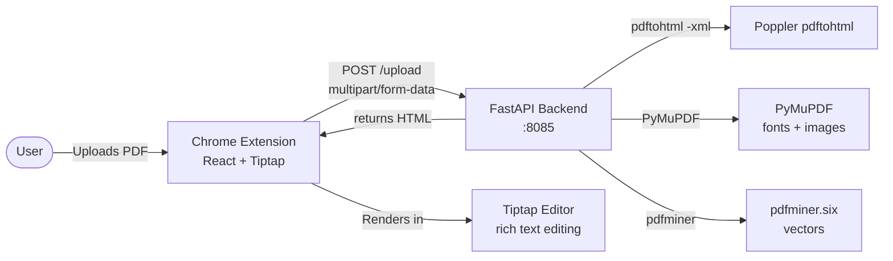
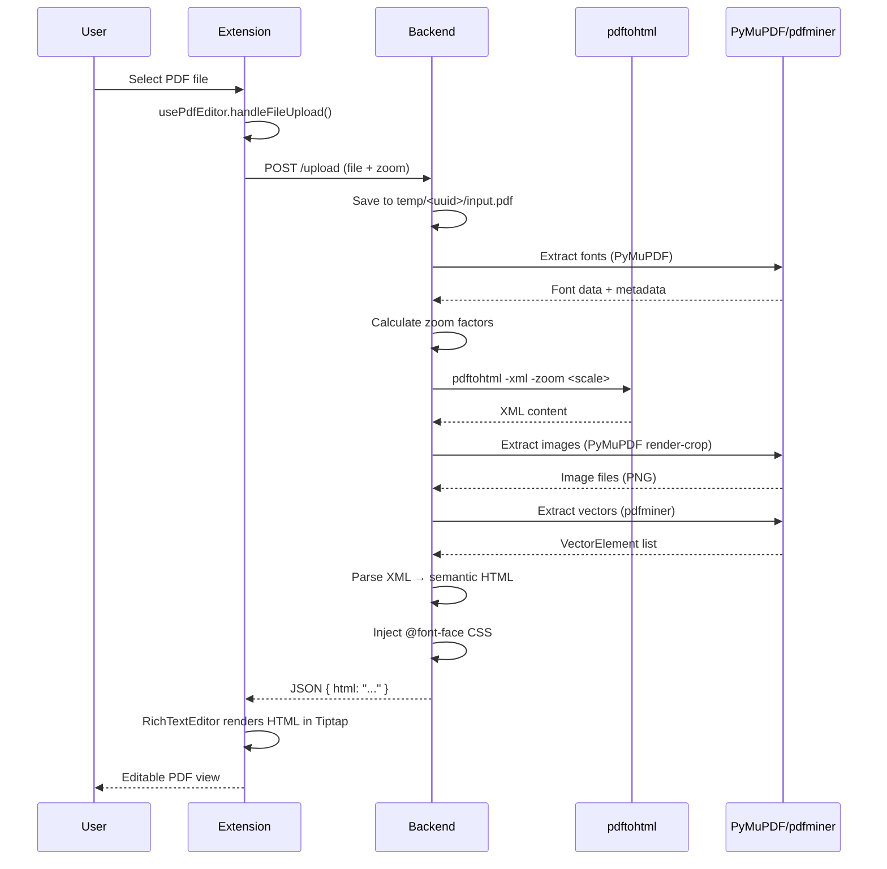

# Architecture

## Architecture Overview

PDF Editor is a two-component system for viewing and editing PDF documents in the browser. A **Chrome extension** (React/TypeScript) serves as the frontend, and a **FastAPI backend** (Python) handles PDF-to-HTML conversion using Poppler's `pdftohtml` tool. The backend transforms PDF files into semantic HTML with embedded fonts, images, and vector graphics, which the extension then renders in a Tiptap-based rich text editor.

**Architectural style:** Client-server with extension shell. The backend is stateless and request-scoped (each upload gets a temp directory, processed, then cleaned up). The frontend is a Chrome Manifest V3 extension that opens a dedicated editor tab.

## 1. Project Structure

```
PDF-editor/
├── backend/                        # Python FastAPI server
│   ├── main.py                     # App entry point, CORS, router wiring
│   ├── routers/
│   │   ├── pdf.py                  # POST /upload endpoint
│   │   └── health.py               # GET /health endpoint
│   ├── services/
│   │   ├── pdf_service.py          # Core conversion orchestrator
│   │   ├── font_embedder.py        # PDF font extraction → @font-face CSS
│   │   ├── font_cache.py           # Font caching (hash-based, filesystem)
│   │   ├── font_extractor/         # PyMuPDF font detail extraction
│   │   ├── vector_parser.py        # PDF vector element parsing (pdfminer)
│   │   ├── image_extractor_pymupdf.py  # Image extraction (PyMuPDF)
│   │   ├── image_extractor/        # Fallback image extractor
│   │   └── xml_parser/             # XML→HTML conversion engine
│   │       ├── parser/             # Core XML parsing logic
│   │       ├── extractors/         # Element, font, image extraction from XML
│   │       ├── renderers/          # HTML rendering (text blocks, tables)
│   │       ├── table_detector/     # Table structure detection
│   │       ├── flow_processor/     # Reading order / column detection
│   │       └── models.py           # Data models (FontSpec, TextElement, etc.)
│   ├── tests/                      # Test directory
│   ├── requirements.txt            # Python dependencies
│   └── temp/                       # Request-scoped temp files (auto-cleaned)
├── extension/                      # Chrome extension (React/TypeScript)
│   ├── src/
│   │   ├── editor.tsx              # Main editor entry point
│   │   ├── editor.css              # Tailwind import
│   │   ├── options.tsx             # Extension options page
│   │   ├── options.css             # Options page styles
│   │   ├── service_worker.ts       # Chrome service worker (MV3)
│   │   ├── util.ts                 # Chrome storage helpers
│   │   ├── hooks/
│   │   │   └── usePdfEditor.ts     # Editor state management hook
│   │   ├── services/
│   │   │   └── pdfService.ts       # Backend API client
│   │   └── components/
│   │       ├── EditorView.tsx      # Main editor layout
│   │       ├── EditorToolbar.tsx   # Top toolbar (file name, zoom, close)
│   │       ├── UploadView.tsx      # Initial upload screen
│   │       ├── FileUploader.tsx    # File input handler
│   │       ├── PreviewFrame.tsx    # iframe-based PDF preview (unused currently)
│   │       ├── LoadingOverlay.tsx  # Loading spinner
│   │       ├── ErrorState.tsx      # Error display with retry
│   │       └── RichTextEditor/     # Tiptap-based rich text editor
│   │           ├── RichTextEditor.tsx  # Editor component
│   │           ├── EditorToolbar.tsx   # Formatting toolbar
│   │           ├── extensions.ts       # Tiptap extensions (Div, Span, Table, etc.)
│   │           └── index.ts
│   ├── public/
│   │   ├── manifest.json           # Chrome MV3 manifest
│   │   └── icon.png
│   ├── editor.html                 # Editor tab HTML shell
│   ├── options.html                # Options tab HTML shell
│   ├── tailwind.config.js          # Tailwind CSS config
│   ├── vite.config.ts              # Vite build config (with zip plugin)
│   ├── tsconfig.json               # TypeScript config
│   └── package.json                # Node dependencies
├── docs/                           # Analysis/debug documentation
├── openspec/                       # OpenSpec change management
├── AGENTS.md                       # AI agent instructions
├── ARCHITECTURE.md                 # This file
└── DESIGN.md                       # Design system documentation
```

## 2. High-Level System Diagram



## 3. Core Components

### 3.1 Frontend — Chrome Extension

**Responsibility:** User interface for uploading PDFs, displaying converted HTML, and enabling rich text editing.

**Key files:**
- `extension/src/editor.tsx` — App entry, state management via `usePdfEditor` hook
- `extension/src/hooks/usePdfEditor.ts` — Central state: file, htmlContent, isLoading, error, zoom
- `extension/src/services/pdfService.ts` — HTTP client posting to `http://localhost:8085/upload`
- `extension/src/components/RichTextEditor/` — Tiptap editor with custom extensions

**Technologies:** React 19, TypeScript, Vite 7, Tailwind CSS v4, Tiptap (ProseMirror), Chrome Extension Manifest V3

**Custom Tiptap Extensions:**
- `Div` — Preserves `<div>` elements with class/style/id attributes for PDF layout fidelity
- `Span` — Preserves `<span>` marks for inline font/color styling from PDF
- `ExtendedParagraph` — Preserves class/style on `<p>` elements
- Table extensions with `data-col-widths` attribute for column width persistence

**Inputs:** PDF file (via file input), zoom level
**Outputs:** Displays editable HTML rendering of the PDF

### 3.2 Backend — FastAPI Server

**Responsibility:** Convert uploaded PDF files to semantic HTML with embedded fonts, images, and vector graphics.

**Key files:**
- `backend/main.py` — FastAPI app, CORS config, router wiring
- `backend/routers/pdf.py` — `POST /upload` endpoint (file + zoom → HTML)
- `backend/services/pdf_service.py` — Core orchestrator: save → fonts → zoom → pdftohtml → images → vectors → tables → HTML → inject fonts

**Technologies:** Python, FastAPI, uvicorn, PyMuPDF (fitz), pdfminer.six, Pillow, aiofiles

**Conversion Pipeline (pdf_service.py):**
1. Save uploaded PDF to temp directory
2. Extract and cache fonts via `FontEmbedder` (PyMuPDF)
3. Calculate zoom factors (72pt→96px DPI conversion, capped at 3.0x for pdftohtml)
4. Run `pdftohtml -xml -stdout -hidden -zoom <scale>` to get XML
5. Extract images via `ImageExtractorPyMuPDF` (render-crop strategy)
6. Extract font details via `FontExtractorPyMuPDF`
7. Parse vector elements via `VectorParser` (pdfminer)
8. Re-run pdftohtml at 1.0x scale for table detection if needed
9. Parse XML to semantic HTML via `xml_parser` module
10. Inject `@font-face` CSS into HTML output
11. Cleanup temp directory

**Inputs:** PDF bytes + zoom level (float)
**Outputs:** JSON `{ html: string }`

### 3.3 XML Parser Engine

**Responsibility:** Convert pdftohtml XML output into semantic HTML with tables, images, vectors, and proper styling.

**Key sub-modules:**
- `parser/` — Core XML parsing, page/block/element logic, rendering orchestration
- `extractors/` — Element extraction, font mapping, image matching
- `renderers/` — HTML rendering for text blocks and grid tables
- `table_detector/` — Table structure detection (line clustering, cell merging, column inference, grid building)
- `flow_processor/` — Reading order detection, column/row analysis, table merging
- `models.py` — Data classes: `FontSpec`, `TextElement`, `ImageElement`, `TableRow`, `TableCell`, `TableDefinition`

### 3.4 Font Pipeline

**Responsibility:** Extract fonts from PDFs, cache them, and generate `@font-face` CSS for embedding.

**Key files:**
- `font_embedder.py` — Main orchestrator: extract → base64-encode → generate CSS → cache
- `font_cache.py` — Filesystem cache with hash-based verification, JSON metadata
- `font_extractor/` — PyMuPDF-based font detail extraction (weight, style detection)

**Caching:** SHA-256 hash of font data stored as cache key; CSS files cached in `fonts_cache/` directory.

## 4. Data Flow

### Request Lifecycle



### Zoom Flow

When the user changes zoom:
1. `usePdfEditor.handleZoomChange()` updates state and re-uploads the same PDF
2. Backend receives new zoom level, recalculates DPI scaling
3. pdftohtml runs at the new scale (capped at 3.0x)
4. If scale ≠ 1.0, a second pdftohtml run at 1.0x provides clean table detection XML
5. Final HTML combines zoomed rendering with properly-detected table structures

## 5. Data Stores

| Store | Type | Purpose | Location |
|-------|------|---------|----------|
| Font cache | Filesystem | Cached font CSS files + JSON metadata | `backend/fonts_cache/` |
| Temp files | Filesystem | Per-request PDF processing (auto-cleaned) | `backend/temp/<uuid>/` |
| Chrome storage | Browser API | Extension preferences (via `util.ts`) | `chrome.storage.local` |

No traditional database. All state is request-scoped or browser-local.

## 6. External Integrations / APIs

| Integration | Method | Config | Auth | Failure Behavior |
|-------------|--------|--------|------|------------------|
| pdftohtml (Poppler) | subprocess | System PATH | None | Startup crash (`RuntimeError`) |
| Chrome Extension APIs | Browser API | `manifest.json` | User permission | Graceful degradation |
| Backend server | HTTP `fetch` | `localhost:8085` (hardcoded) | None | Error displayed in UI |

## 7. Key Technologies

| Layer | Technology | Version | Role |
|-------|-----------|---------|------|
| Frontend | React | 19.2.3 | UI framework |
| Frontend | TypeScript | 5.9.3 | Type safety |
| Frontend | Vite | 7.2.7 | Build tool + dev server |
| Frontend | Tailwind CSS | 4.1.18 | Styling (via `@tailwindcss/vite`) |
| Frontend | Tiptap | 3.13.x | Rich text editor (ProseMirror) |
| Frontend | JSZip | 3.10.1 | Build-time zip packaging |
| Frontend | Lucide React | 0.561.0 | Icons |
| Backend | Python | 3.x | Runtime |
| Backend | FastAPI | latest | HTTP framework |
| Backend | uvicorn | latest | ASGI server |
| Backend | PyMuPDF | latest | PDF font/image extraction |
| Backend | pdfminer.six | latest | Vector element parsing |
| Backend | Pillow | latest | Image processing |
| Backend | aiofiles | latest | Async file I/O |
| System | Poppler (pdftohtml) | - | PDF→XML conversion |

## 8. Deployment & Infrastructure

**Development setup:**
```bash
# Backend
cd backend && source venv/bin/activate && uvicorn main:app --reload --port 8085

# Extension
cd extension && npm run dev  # Vite watch mode
```

**Build artifacts:**
- `extension/dist/` — Built extension files
- `extension/zip/pdf-editor<version>.zip` — Packaged extension for Chrome Web Store (auto-generated by Vite plugin)

**No containerization, no CI/CD pipeline, no deployment automation.**

The backend requires Poppler utilities (`pdftohtml`) installed on the system.

## 9. Security Architecture

- **CORS:** Currently allows all origins (`*`) — flagged for restriction
- **No authentication** on the backend upload endpoint
- **No input validation** beyond content-type check (`application/pdf`)
- **No rate limiting** on upload endpoint
- **Temp files** are cleaned up after each request (UUID-scoped directories)
- **Chrome extension permissions:** Only `storage` requested (minimal)
- **Service worker** opens editor in a new tab on icon click (no background processing)

## 10. Monitoring & Observability

- **Logging:** Python `print()` statements with emoji prefixes (⚠️, ✓) — no structured logging
- **No metrics, tracing, or error reporting**
- **No health check beyond `GET /health` returning `{"status": "ok"}`**

## 11. Performance & Scalability

- **Per-request temp directories** with UUID isolation prevent collisions but add I/O overhead
- **Font caching** (filesystem) avoids re-extracting the same fonts across requests
- **pdftohtml cap at 3.0x** prevents excessive memory usage for high zoom levels
- **Double pdftohtml run** at non-1.0x zoom levels (once for rendering, once at 1.0x for table detection) adds latency
- **No concurrency control** — FastAPI async handlers but subprocess calls block the event loop
- **Image extraction** uses render-crop strategy (high quality but computationally expensive)
- **Single-threaded backend** (uvicorn default) — would need workers for production

## 12. Development Workflow

| Command | Location | Purpose |
|---------|----------|---------|
| `uvicorn main:app --reload --port 8085` | `backend/` | Start backend dev server |
| `npm run dev` | `extension/` | Vite watch mode (builds extension) |
| `npm run build` | `extension/` | Production build + zip |

**Prerequisites:**
- Python 3.x with venv
- Node.js (v22.18.0+)
- Poppler utilities (`pdftohtml` in PATH)

## 13. Testing Strategy

- `backend/tests/` directory exists with analysis documentation (`README_TABLE_ROWS.md`, `TABLE_ROW_ANALYSIS.md`)
- No visible automated test suite (no pytest configuration, no test runner scripts)
- `test_output*.txt` files in backend root suggest manual testing via script execution
- No frontend tests (no test framework in `package.json` devDependencies)

## 14. Architectural Decisions & Rationale

1. **pdftohtml over pure-Python PDF parsing** — Better layout fidelity for complex PDFs; trades off a system dependency
2. **PyMuPDF for fonts/images over pdfminer** — More reliable extraction, native support for font data and pixmap rendering
3. **pdfminer for vectors** — pdfminer's layout analysis provides structured vector element data that PyMuPDF doesn't expose as cleanly
4. **Tiptap over raw contentEditable** — Structured editing with extension system; custom extensions preserve PDF layout attributes
5. **Server-side zoom** — Rendering at the correct DPI on the server ensures visual fidelity; client-only zoom would require re-rendering the entire PDF
6. **Font embedding via base64 data URIs** — Self-contained HTML output; no need for font file serving
7. **Chrome extension (not web app)** — Access to Chrome APIs, native PDF handling, browser integration

## 15. Constraints, Risks, and Technical Debt

- **Hardcoded backend URL** (`localhost:8085`) in `pdfService.ts` — no config mechanism
- **No auth/rate limiting** — backend is open to any client
- **CORS wildcard** — documented as temporary
- **No automated tests** — manual testing only
- **No CI/CD** — no automated builds, linting, or deployment
- **Subprocess blocking** — `subprocess.run()` in async handlers blocks the event loop
- **Print-based logging** — no structured logging, no log levels
- **Multiple git repos** — `backend/.git/` and `extension/.git/` are independent repos within the monorepo structure
- **Options page is empty** — `options.tsx` is a placeholder
- **Zoom re-uploads entire PDF** — changing zoom triggers a full re-conversion rather than client-side CSS transform

## 16. Future Considerations

- **Restrict CORS** to specific origins before any public deployment
- **Add authentication** (API key or session-based) for the upload endpoint
- **Client-side zoom via CSS transform** — avoid re-upload; only re-convert for print/export
- **Structured logging** with Python `logging` module
- **Automated test suite** — pytest for backend, vitest for extension
- **CI/CD pipeline** — GitHub Actions for lint, test, build
- **Web Worker for pdftohtml** — move subprocess calls off the async event loop
- **Configurable backend URL** — environment variable or extension options page
- **Error boundaries** in React components for graceful failure
- **Progress reporting** for large PDF uploads

## 17. Project Identification

| Field | Value |
|-------|-------|
| Name | PDF Editor |
| Languages | TypeScript (frontend), Python (backend) |
| Type | Chrome Extension + API Server |
| Runtime | Browser (Chrome MV3) + Python (FastAPI/uvicorn) |
| Date of review | 2026-07-18 |
| Maintainer | Not specified |

## 18. Glossary

| Term | Meaning |
|------|---------|
| **pdftohtml** | Poppler utility that converts PDF to XML/HTML with layout information |
| **PyMuPDF** | Python bindings for MuPDF PDF library (imported as `fitz`) |
| **pdfminer.six** | Pure-Python PDF parsing library for text and layout extraction |
| **Tiptap** | Headless rich text editor framework built on ProseMirror |
| **MV3** | Chrome Extension Manifest Version 3 |
| **@font-face** | CSS rule for embedding custom fonts in web pages |
| **render-crop** | Image extraction strategy that renders the visible page area at native resolution |
| **DPI conversion** | PDF points (72 DPI) to CSS pixels (96 DPI) scaling factor |
| **XML parser** | The `xml_parser` module that converts pdftohtml XML output to semantic HTML |

<!-- Last updated: 2026-07-18T00:00:00Z -->
